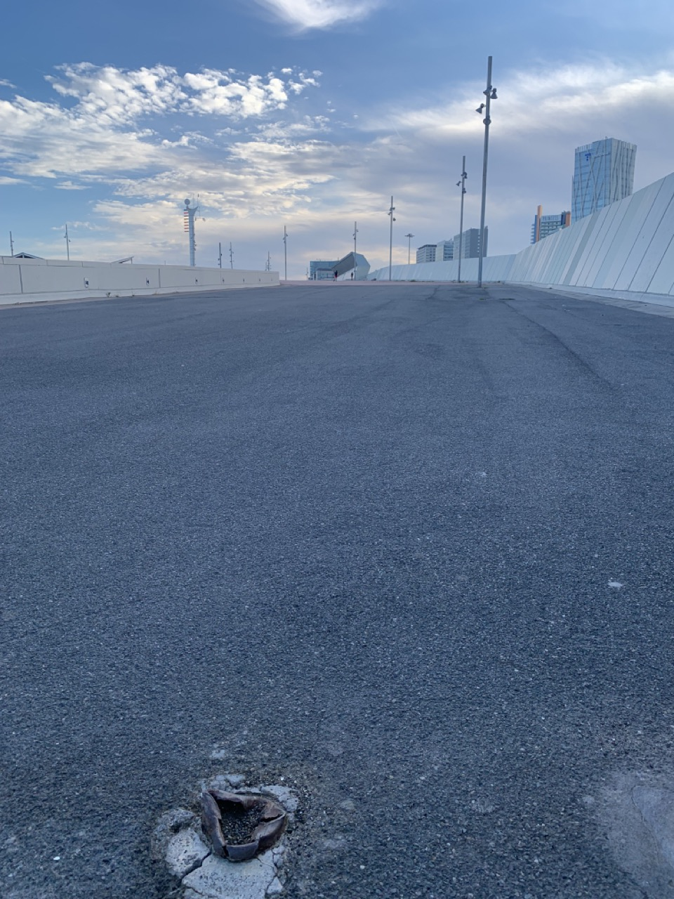
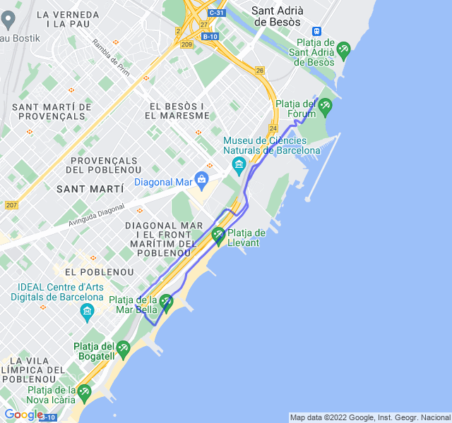

Poche nuvole, 29°C, Percepito 33°C, Umidità 75%, Vento 4m/s da SSO

Grande umidità... l'ideale per delle delle ripetute in salita?

Si vede la scia di sudore lascaita sull'asfalto?

In generale è andata abbastanza bene, forse un po' meno brillante delle ultime fatte settiman scorsa ma ci può stare visto che ieri ho fatto un variato.

<iframe allowtransparency="true" scrolling="no" src="https://www.strava.com/activities/7770786213/embed/03c0bcd8be6bfe7576af9d57e3697628a54f1d5c" width="590" height="405" frameborder="0"></iframe>

[Link all'attività](https://strava.com/activities/7770786213)
