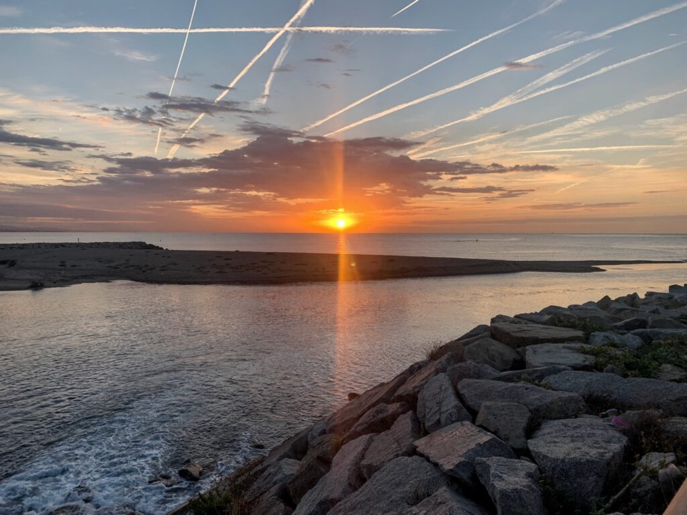
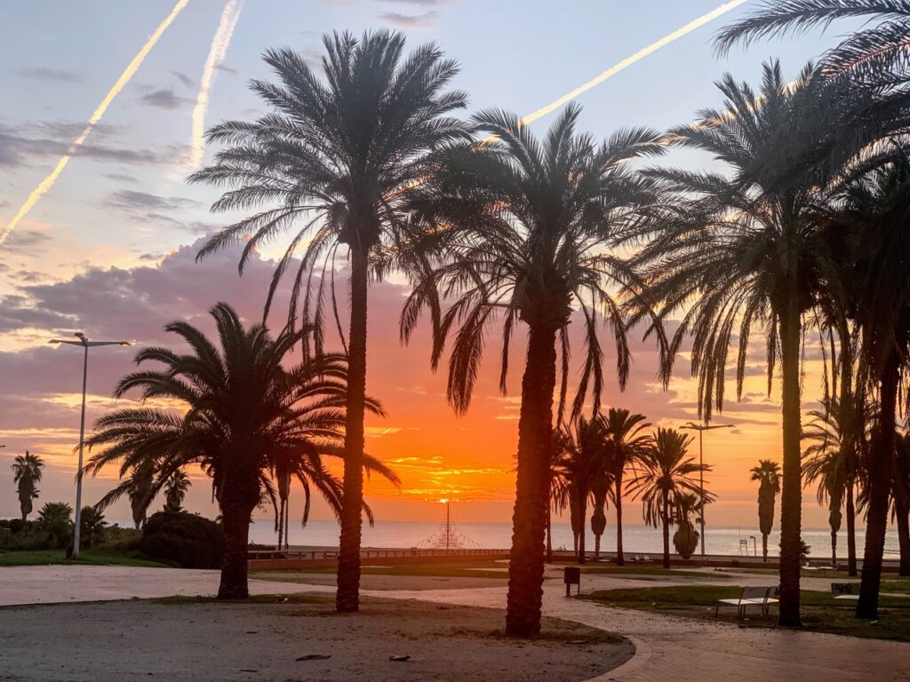
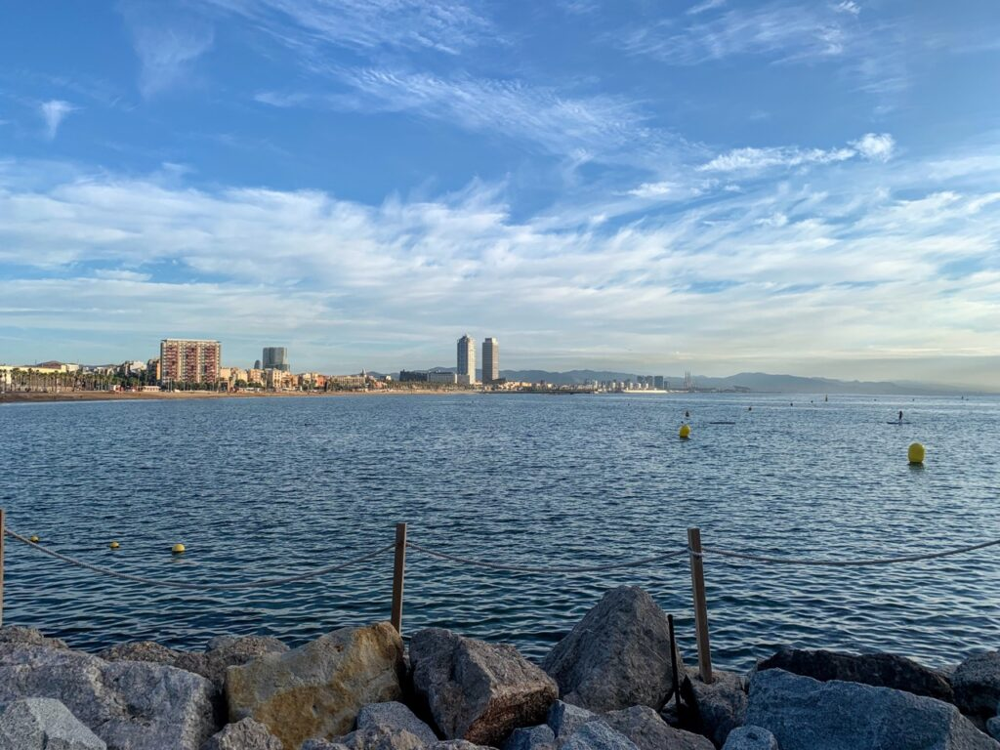
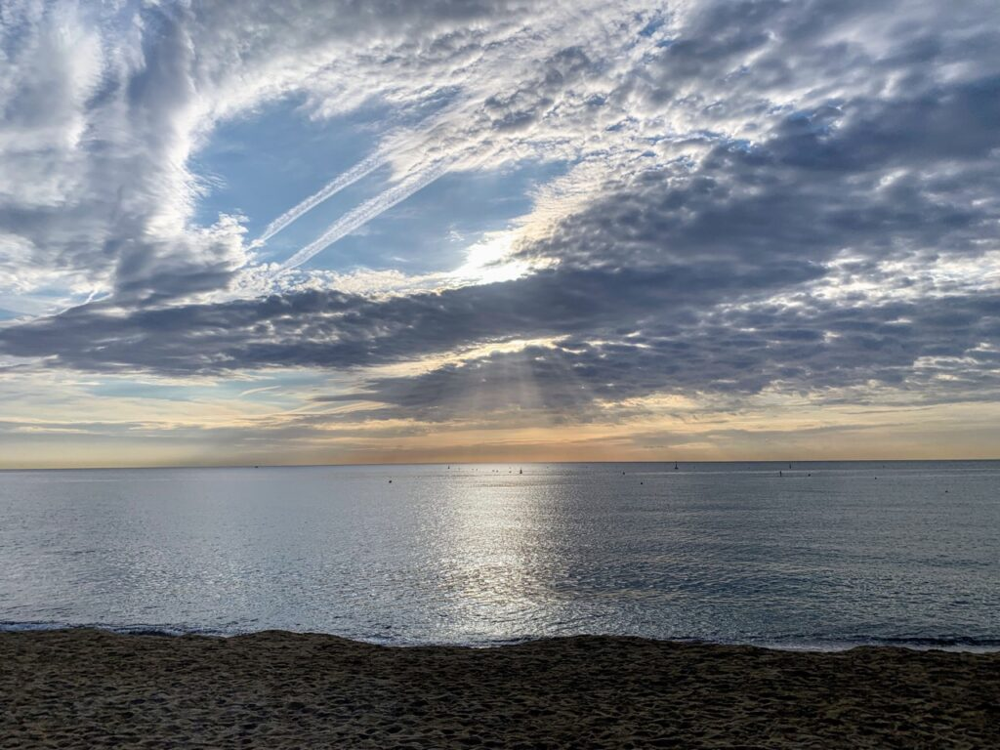
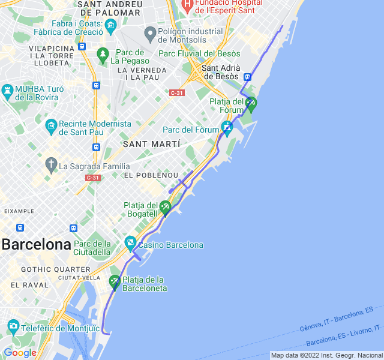

Cielo sereno, 23°C, Percepito 23°C, Umidità 74%, Vento 4m/s da NO

Prima uscita mattutina da quando sono a Barcellona. Davvero bello sia il panorama che l'atmosfera con un sacco di corridori in giro.

D'ora in poi probabilmente riuscirò a farlo spesso e la cosa non può che migliorare rispetto agli allenamenti stile sauna in pausa pranzo.

L'allenamento è andato abbastanza bene anche se ho commesso due errori da principiante: ho dimenticato le cuffie 🎧 e non ho portato con me un gel. Soprattutto la seconda l'ho pgata nell'ultimo tratto dove avevo parecchia fame essendo partito senza colazione.  
Me ne ricorderò la prossima volta 🤞



[Link all'attività](https://strava.com/activities/7778471137)
