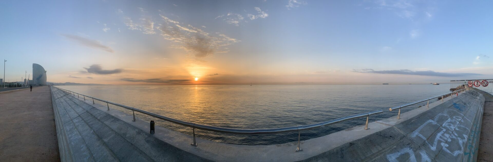
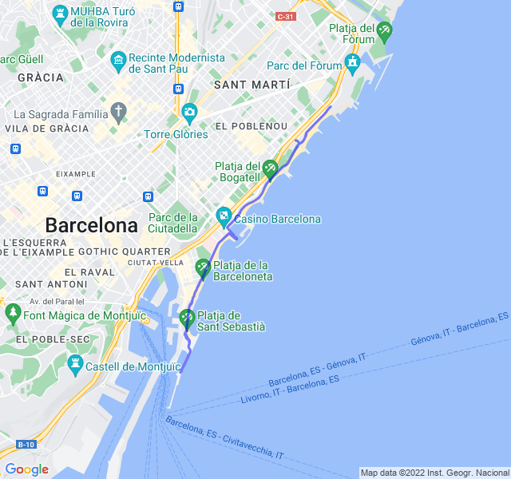

Cielo sereno, 24°C, Percepito 25°C, Umidità 87%, Vento 3m/s da NNO

Ripetute lunghe a ritmo maratona. Buone sensazioni anche se alla fine un po' di fame.

<iframe allowtransparency="true" scrolling="no" src="https://www.strava.com/activities/7794479604/embed/312ea728c694aa82f4d59da02c46e324beaf089c" width="590" height="405" frameborder="0"></iframe>

[Link all'attività](https://strava.com/activities/7794479604)
