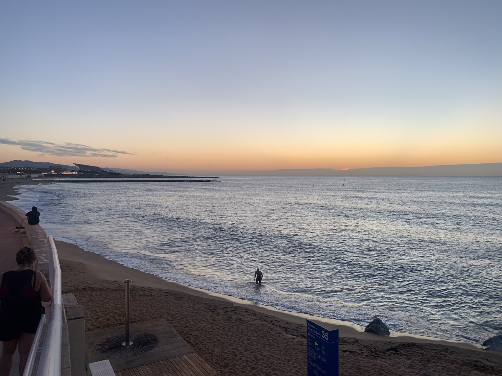
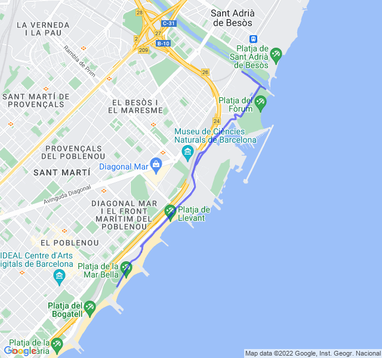

Pioggia leggera, 23°C, Percepito 23°C, Umidità 79%, Vento 5m/s da NNO

Non avevo ancora ben recuperato il variato del giorno precedente quindi è stato parecchio faticoso fare queste ripetute in salita. Sicuramente non ho spinto al massimo proprio perchè non mi sentivo particolarmente fresco.

 all'attività](https://strava.com/activities/7805424068)
