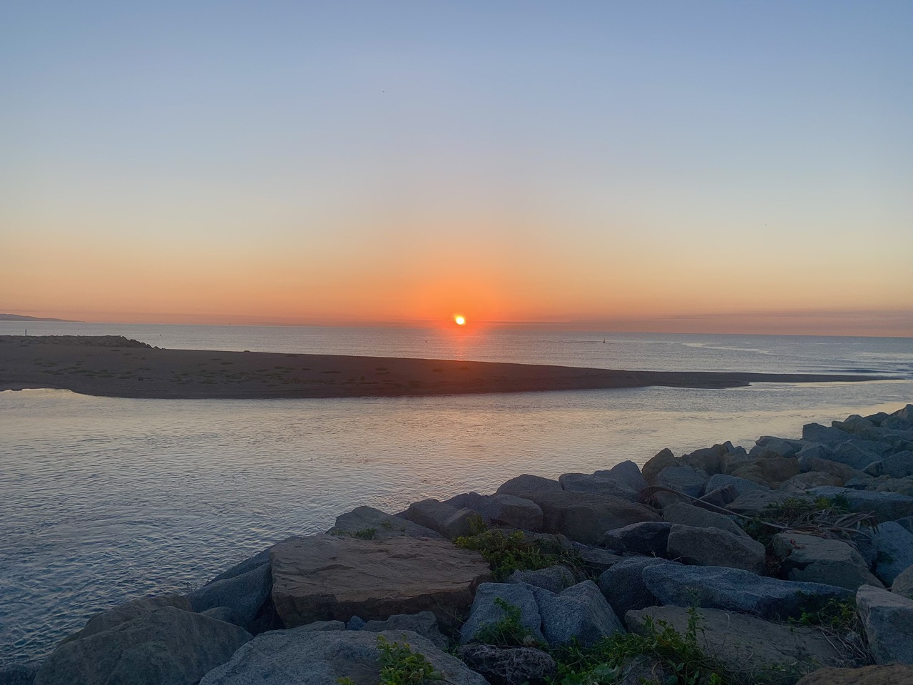
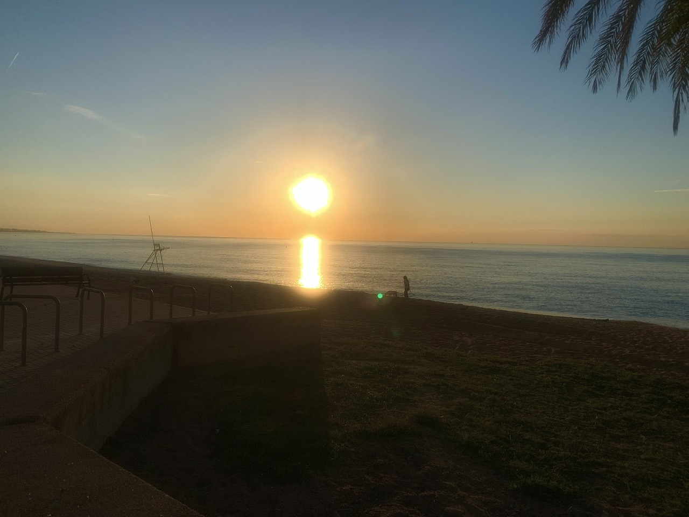
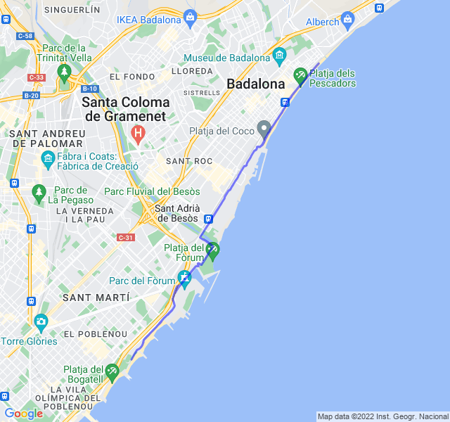

Poche nuvole, 22°C, Percepito 23°C, Umidità 82%, Vento 5m/s da NO

Lungo settimanale a ritmo maratona andato abbastanza bene. Un po' affaticato verso la fine come mi succede spesso quando corro al mattino a digiuno.

Bellissimi i pesaggi all'alba, tra poco probabilmente non li vedrò più con l'accorciarsi delle giornate.



[Link all'attività](https://strava.com/activities/7815941339)
