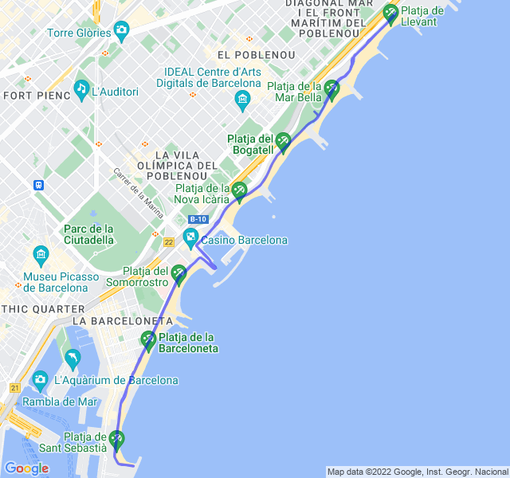

Poche nuvole, 25°C, Percepito 25°C, Umidità 64%, Vento 5m/s da SE

Prima uscita a in pausa pranzo da un po' di settimane: andata meglio del previsto. Il caldo non è più così terribile e, per la prima volta da un bel po' di tempo, ho tenuto un'uscita intera in pieno controllo, tenendo battiti bassi e movimenti controllati.

Molto bene, si inizia a sperare!


