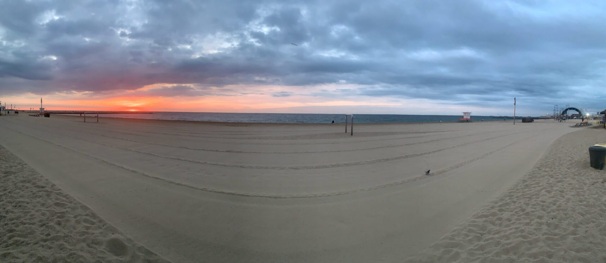
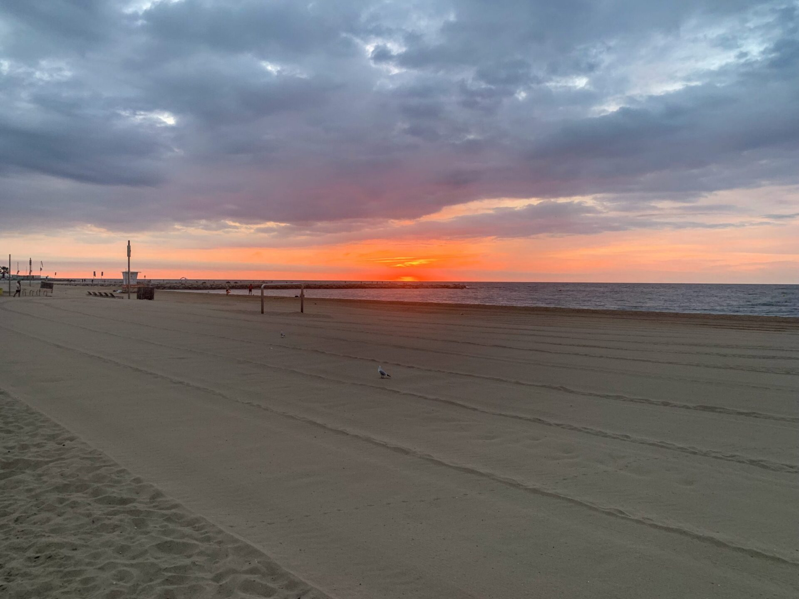
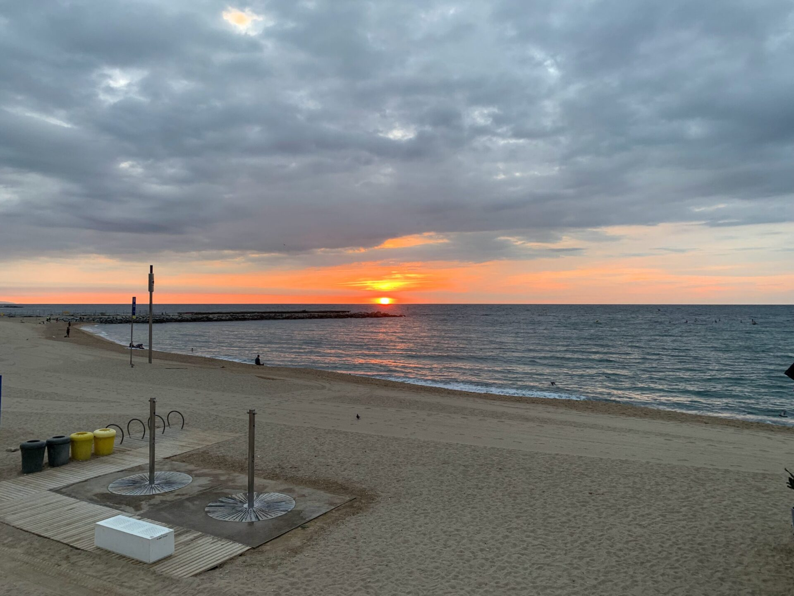
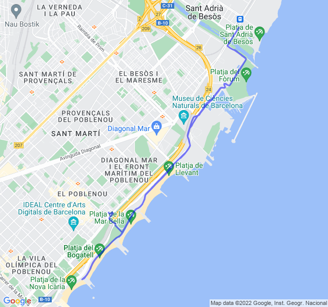

Nubi sparse, 21°C, Percepito 21°C, Umidità 72%, Vento 4m/s da ENE

Variato più ripetute in salita. Un po' di fatica questa mattina forse a causa della notte non particolarmente riposante.

Il vero test sarà domattina con i 14km di FL, vediamo che succederà.

Sicuramente lo spettacolo dell'alba vale sempre il prezzo della fatica!


