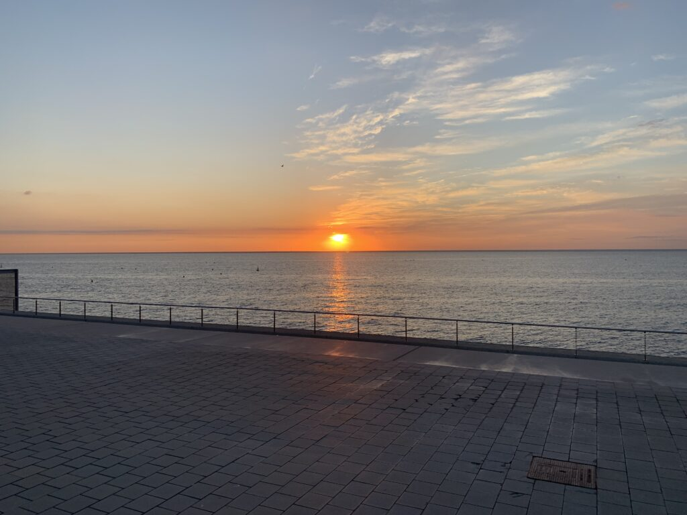
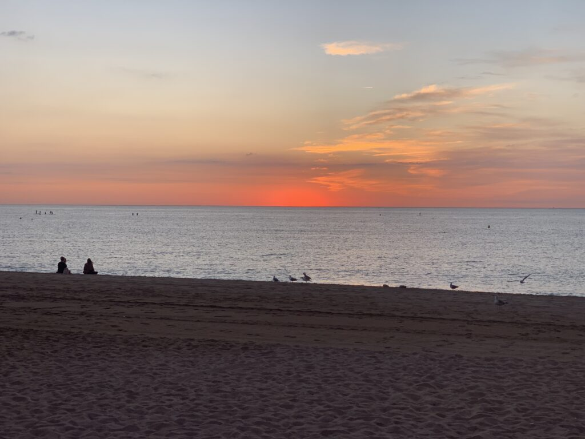
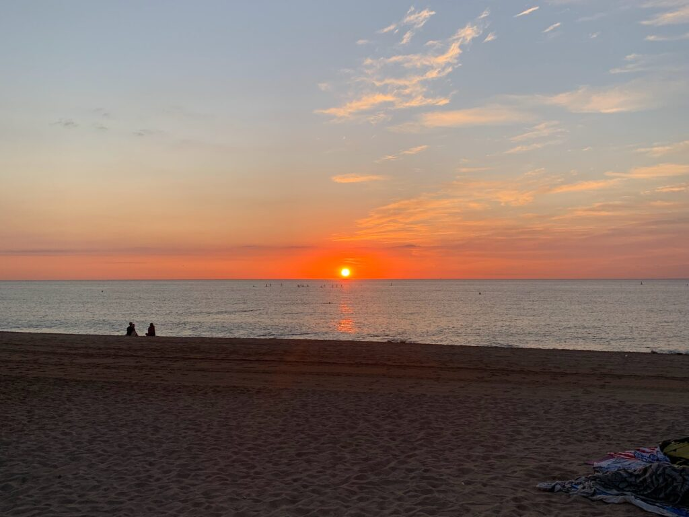
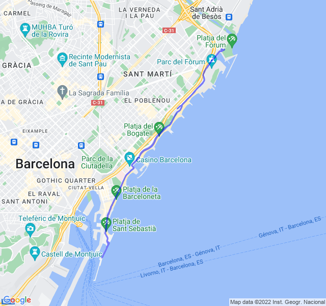

Poche nuvole, 21°C, Percepito 21°C, Umidità 85%, Vento 4m/s da NNO

Lunghetto di metà settimana dopo due giorni di lavori. Più faticoso di quello che il passo avrebbe richiesto ma ci più stare.

Tra 2 giorni primo lungo _serio_ da 24km, lì probabilmente si capirà se riesco effettivamente a tenere i ritmi prefissati o se andranno ritoccati un po'.

La grande incognita è l'alimentazione: come fare a non avere problemi durante un lungo partendo mezz'ora dopo essermi alzato??



[Link all'attività](https://strava.com/activities/7842347591)
