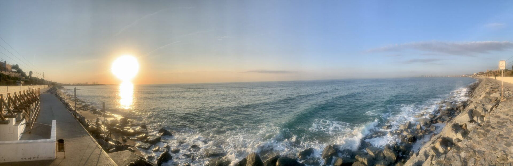
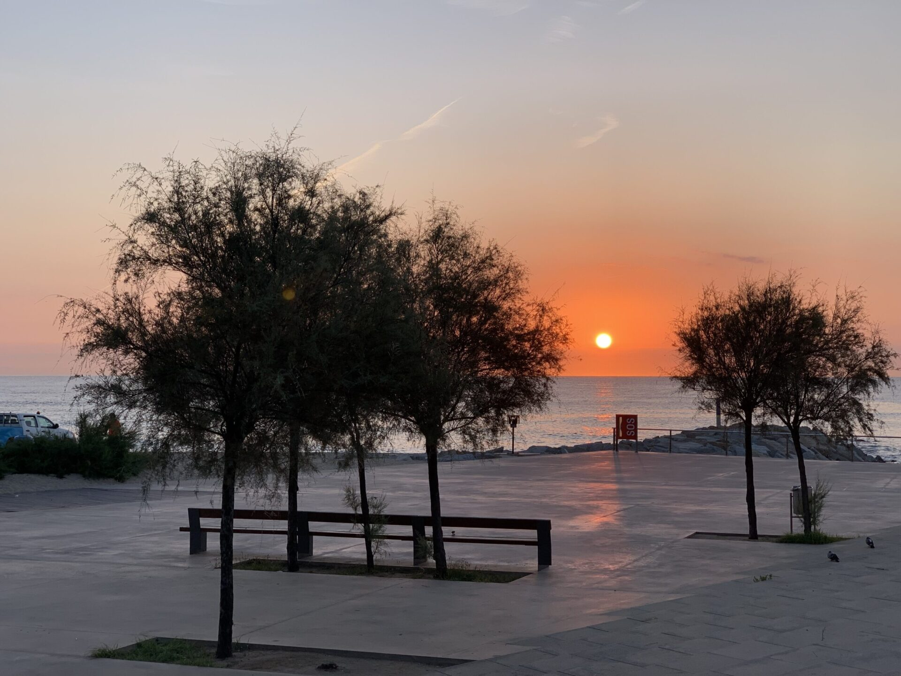
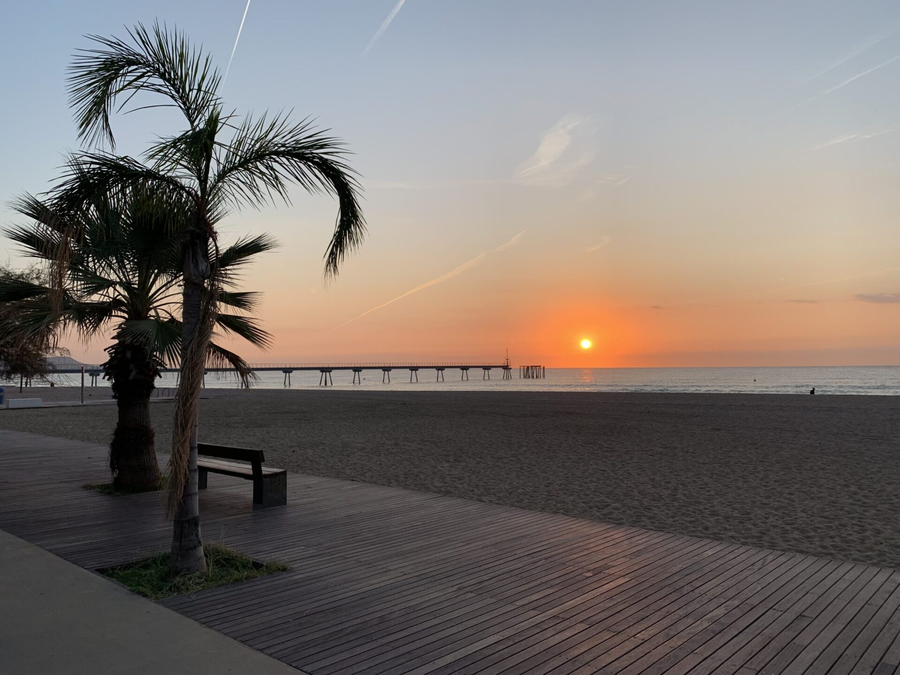
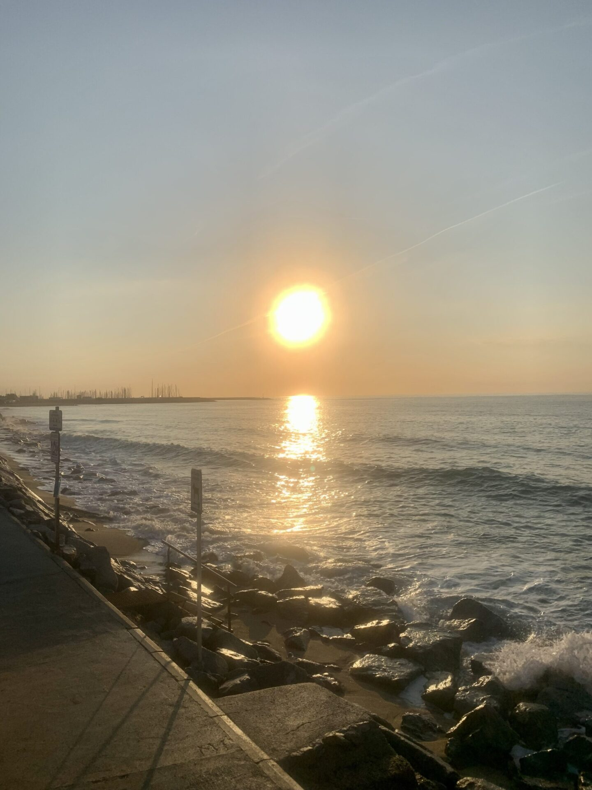
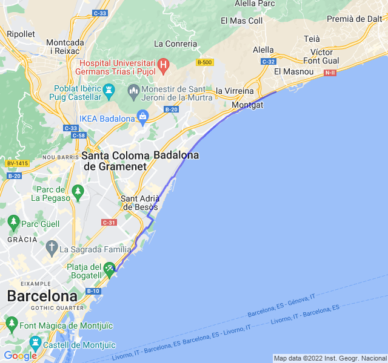

Cielo sereno, 19°C, Percepito 19°C, Umidità 80%, Vento 4m/s da NNO

Primo lungo serio della preparazione. Grande ansia prima perché è tanto che non mi spingo oltre la mezza, oltretutto dopo una settimana di _carico_.

Le sensazioni sono state buone. Qualche dolorino e un po' di fatica verso la fine. Alcune pause: due per mangiare qualcosa, due per bere e una per fare una foto. Tutte molto brevi.

Uno dei timori più grandi era l'alimentazione partendo da casa sostanzialmente a digiuno. Da questo punto di vista non ho avuto troppi problemi: ho bevuto il mio solito _beverone_ di carboidrati prima di partire, una barretta dopo 5km (avevo i crampi per la fame) e un gel dopo 1h15m. Da tenere in considerazione per le prossime uscite.

In definitiva una buona uscita; se penso che ne mancherebbero ancora 18... aiuto!



[Link all'attività](https://strava.com/activities/7852959615)
