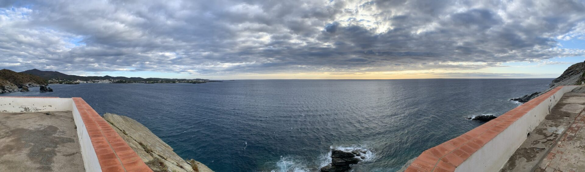
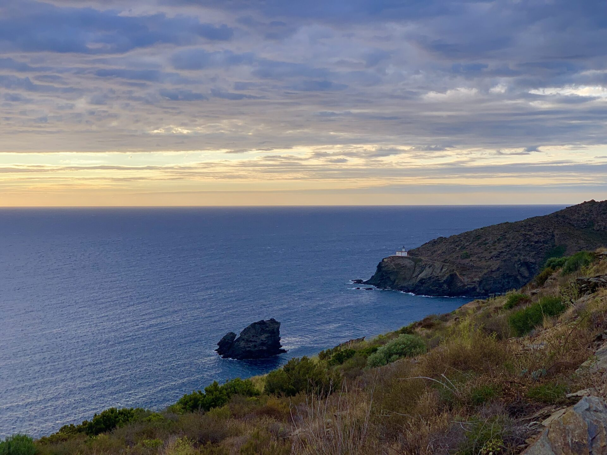
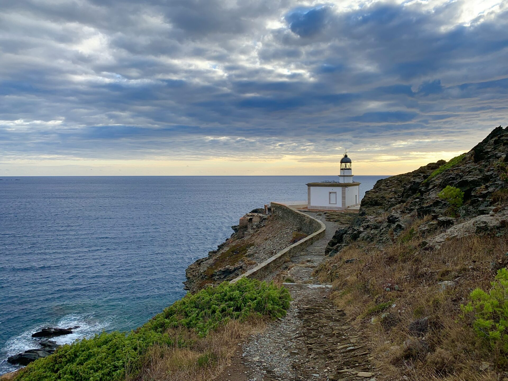
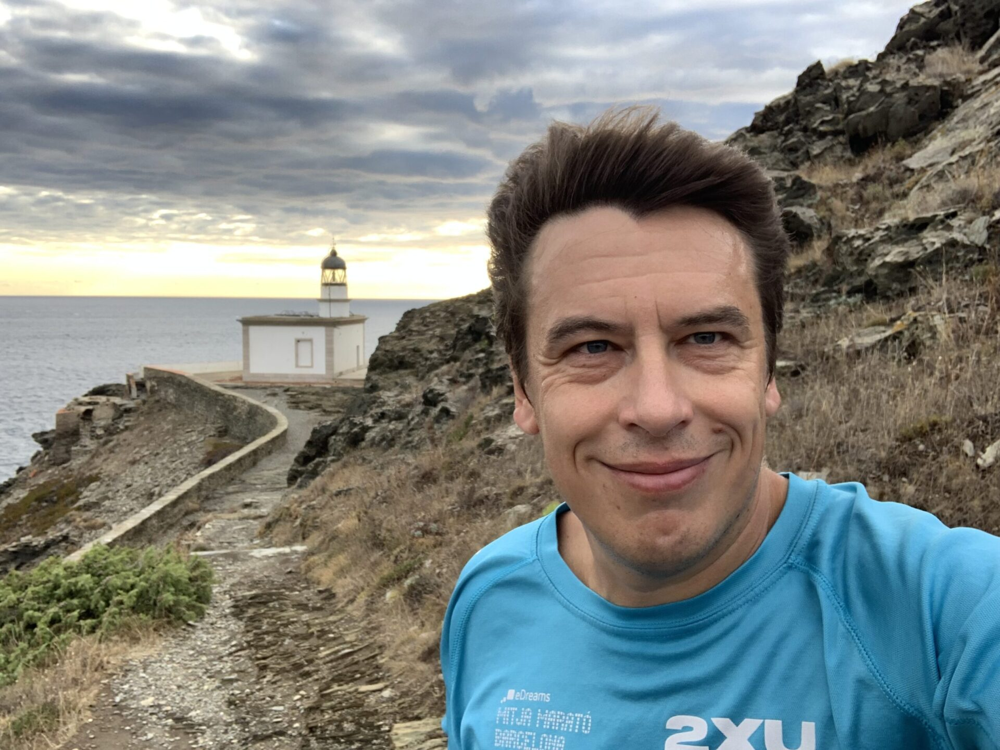
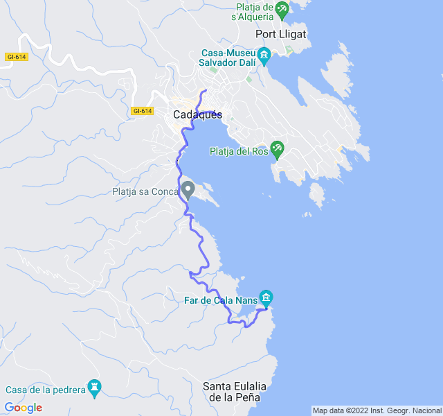

Poche nuvole, 16°C, Percepito 15°C, Umidità 79%, Vento 6m/s da N

Uscita in trasferta a Cadaqués. Bel trail fino al Far de Cala Nans, doveva essere un lento rigenerante ma ho sottovalutato le salite per arrivarci, brevi ma con una bella pendenza. Alla fine è stato abbastanza faticoso ma ne è valsa la pena!

 all'attività](https://strava.com/activities/7862834844)
