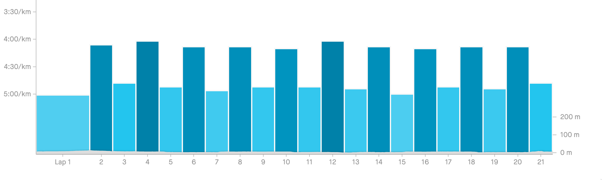
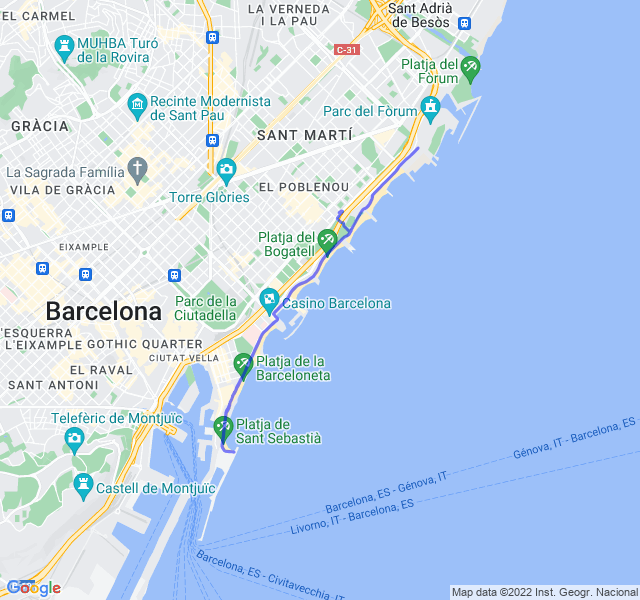

Cielo sereno, 16°C, Percepito 16°C, Umidità 66%, Vento 4m/s da NO

Oggi ottime ripetute dopo molto tempo. Ho tenuto i ritmi senza faticare più del dovuto e senza soste di alcun tipo.

Ottima uscita!



[Link all'attività](https://strava.com/activities/7873241953)
