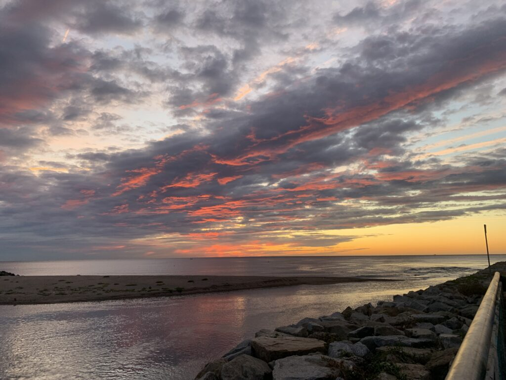
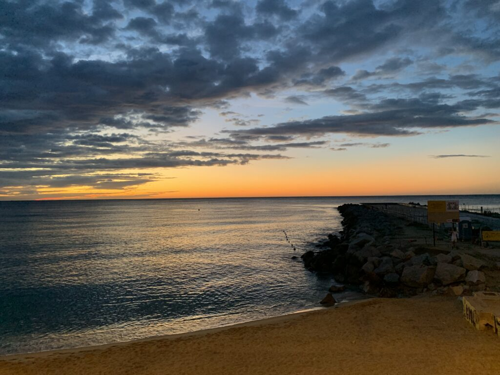
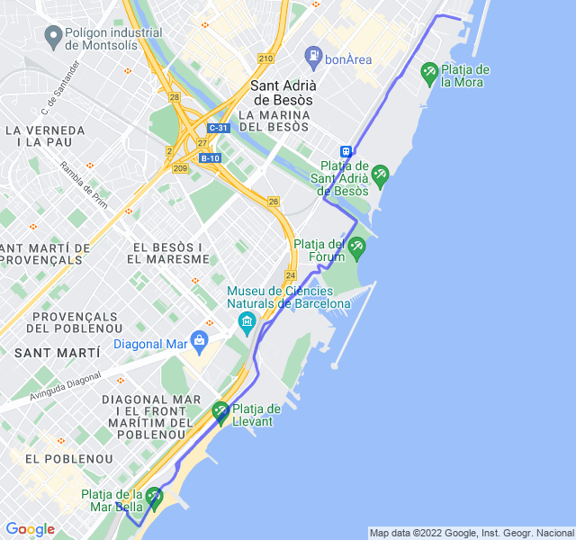

Poche nuvole, 17°C, Percepito 17°C, Umidità 74%, Vento 5m/s da NO

Uscita faticosa questa mattina. Le gambe non giravano bene; dolorini al tendine di Achille come spesso mi capita quando uso le HOKA; grande fatica nelle ripetute finali.

Non può andare sempre bene, speriamo meglio per il lungo _veloce_ di venerdì.



[Link all'attività](https://strava.com/activities/7878485483)
