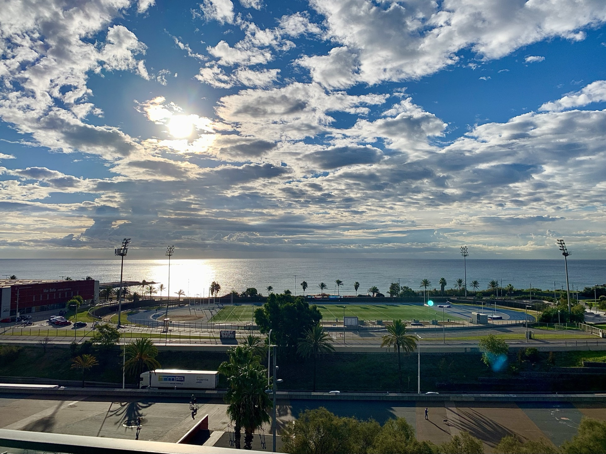
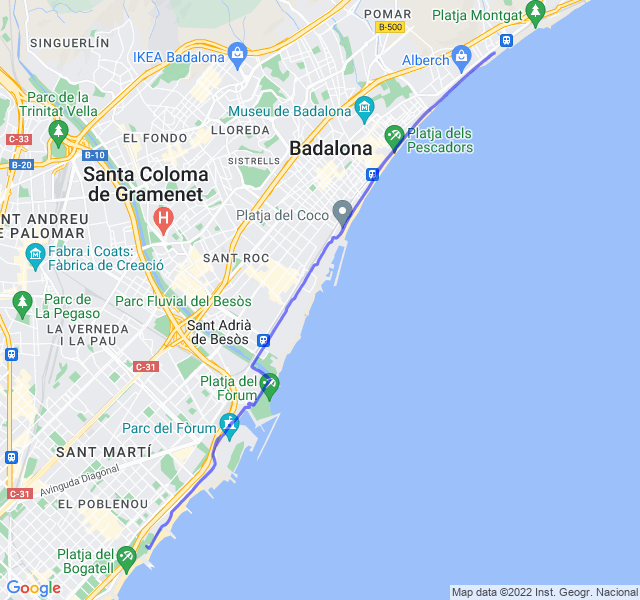

Poche nuvole, 15°C, Percepito 15°C, Umidità 75%, Vento 5m/s da NNO

Ero molto preoccupato per questo lungo a ritmo un po' allegro ed invece è una delle migliori uscite del periodo. La forma forse sta tornando veramente.

Inizia però a fare freddo, dovrò organizzarmi con qualcosa!

 all'attività](https://strava.com/activities/7888295243)
