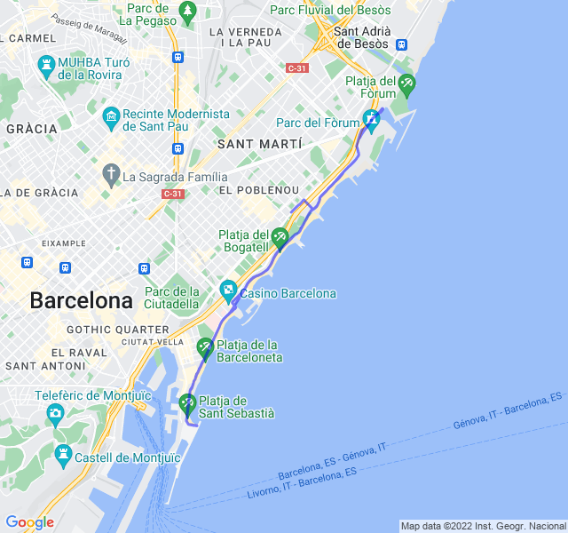

Cielo sereno, 19°C, Percepito 19°C, Umidità 84%, Vento 3m/s da NNO

Ero molto preoccupato per questi 5+3 ma alla fine sono andati bene. Anche le ripetute in salita alla fine non mi sono pesate tantissimo.

Unico punto dolente, un fastidio al ginocchio destro da subito, speriamo bene.

 all'attività](https://strava.com/activities/7908428605)
