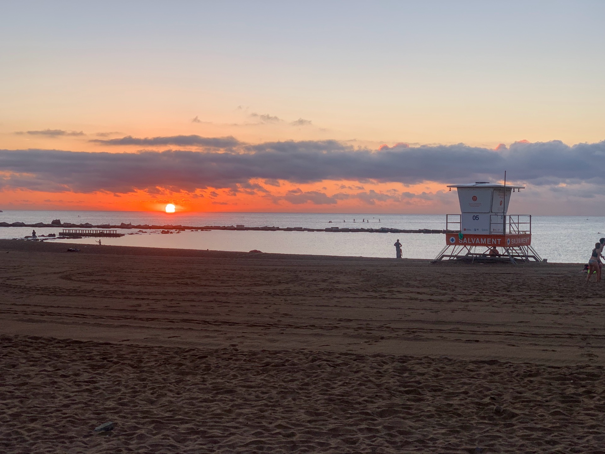
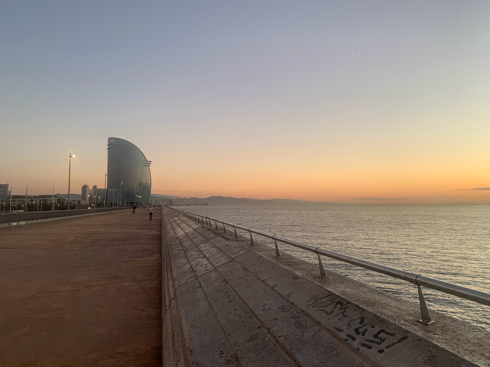
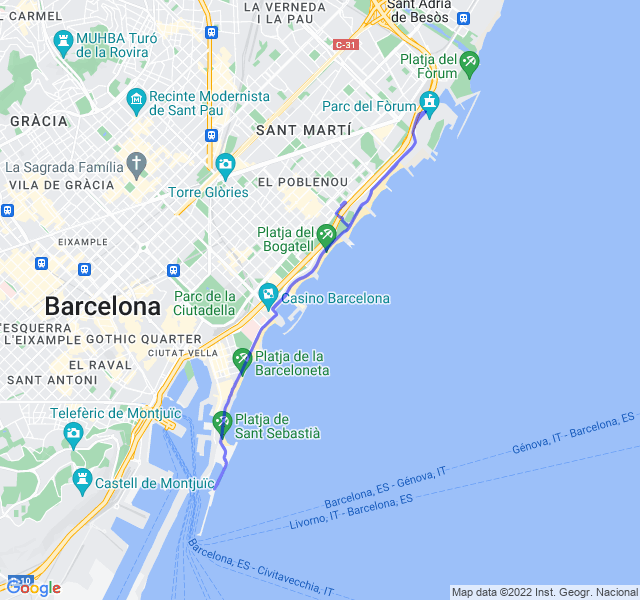

Poche nuvole, 18°C, Percepito 19°C, Umidità 89%, Vento 4m/s da NNO

Un po' di fatica verso la fine ma ci può stare: il mercoledì è sempre un giorno complicato dopo i 2 allenamenti consecutivi.

Fastidio al ginocchio ancora presente e un po' in aumento. Forse è il caso di prendere un anti infiammatorio.



[Link all'attività](https://strava.com/activities/7913777386)
