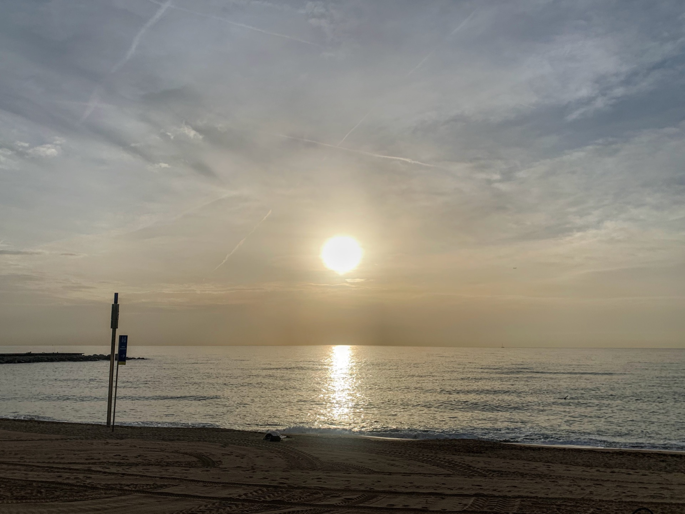

Primo allenamento impegnativo dopo la pausa forzata per il dolore al ginocchio. Devo dire che è andato bene, forse meglio del previsto; temevo di non riuscire a tenere la parte veloce delle ripetute invece sono andate abbastanza lisce. Due pause per bere e prendere un gel perché alla mattina senza è difficile spingere fino in fondo in queste sedute.

Si ricomincia a sperare in bene per Valencia.


