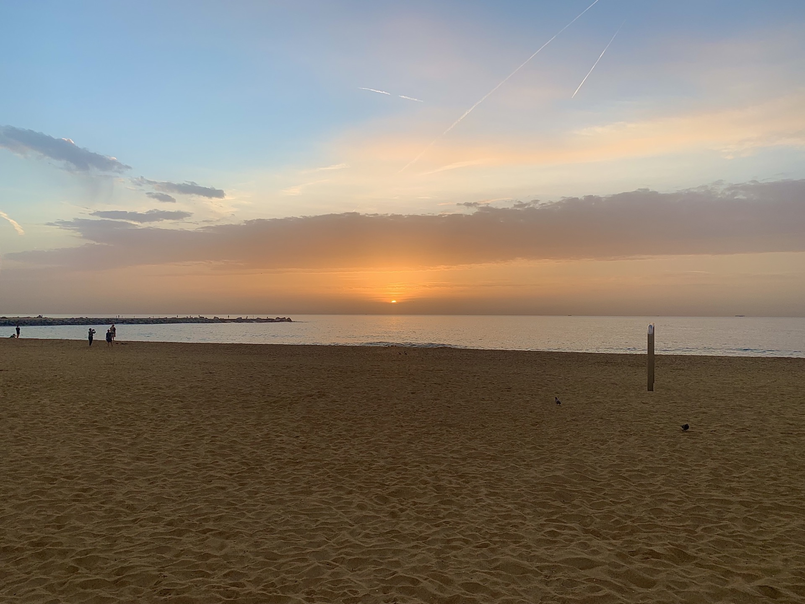
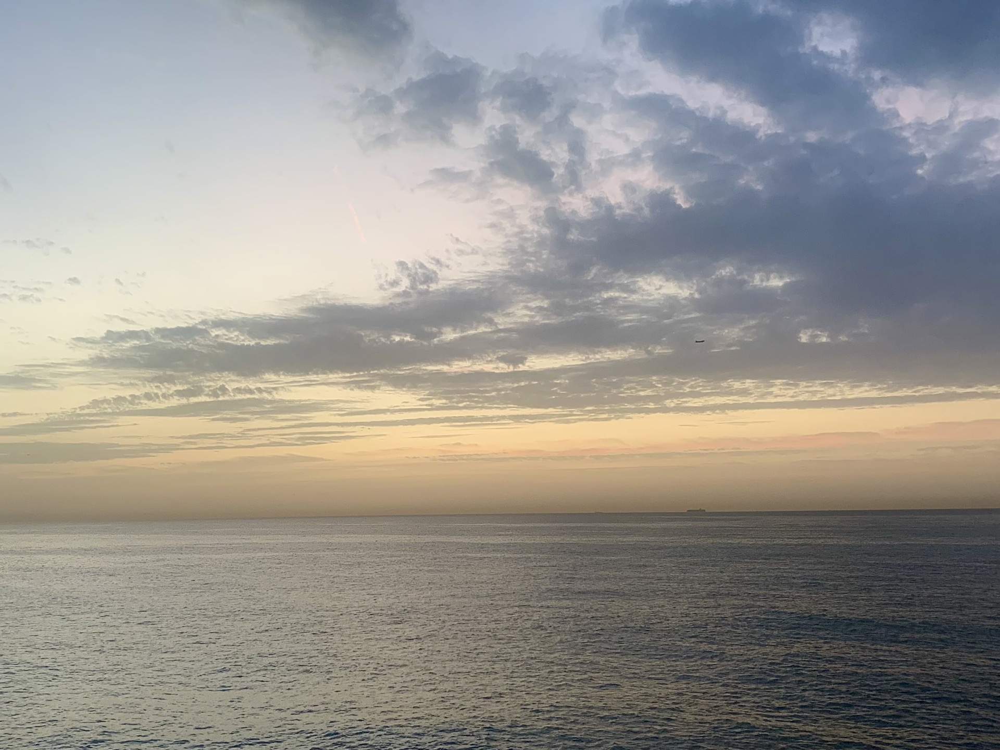
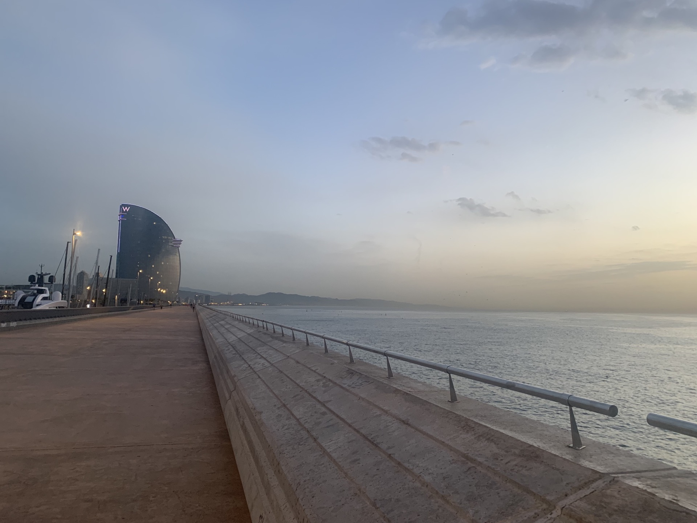
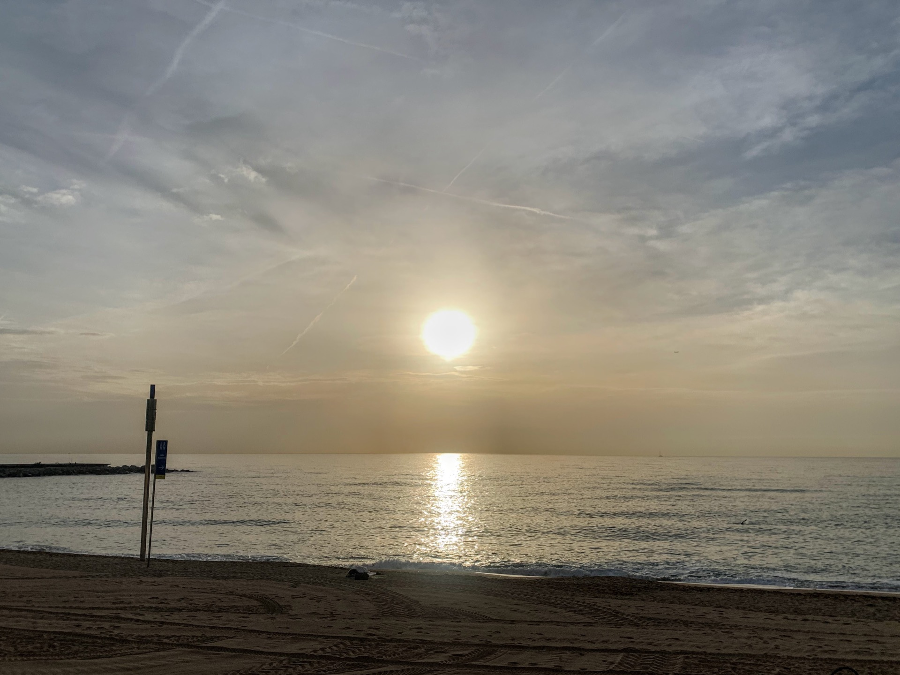
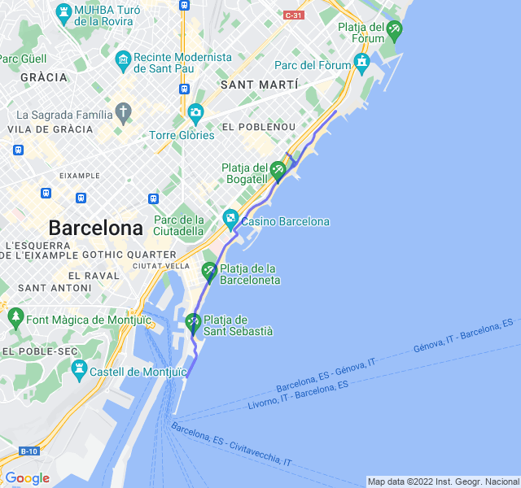

Fondo lento tranquillo. Un po' di pesantezza ai quadricipiti dati dal potenziamento di settimana scorsa.

Finalmente la frequenza cardiaca sembra restare sotto controllo per tutto l'allenamento.


