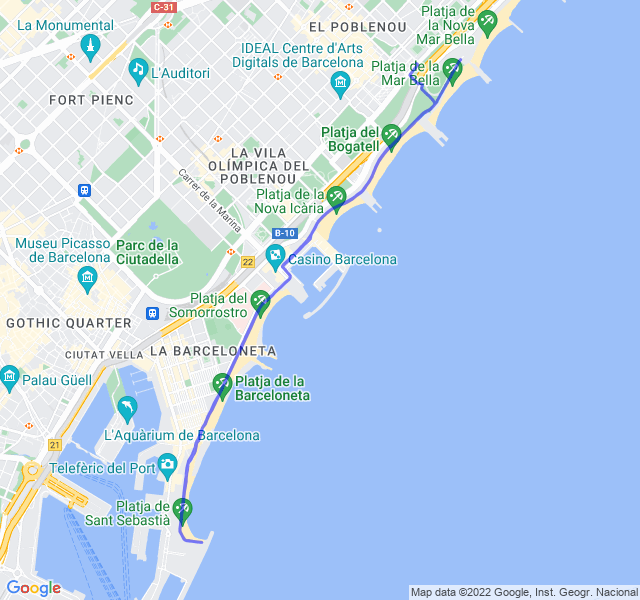

Allenamento pessimo, uno dei peggiori di questo periodo.

Dovevano essere 12km con in più delle ripetute in salita alla fine ma le gambe non c'erano proprio, fatica fatica fatica.

Nel pomeriggio anche mal di testa, speriamo che sia solo passeggero e che si risolva tutto per venerdì quando avrò il lunghissimo, molto importante in vista della maratona!

Speriamo 🤞🏻



[Link all'attività](https://strava.com/activities/8020538022)
