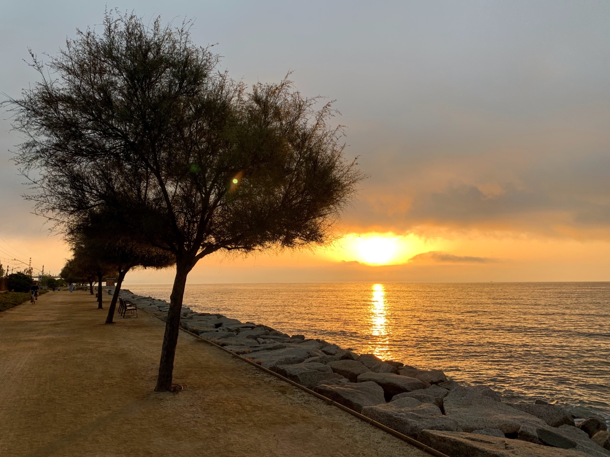
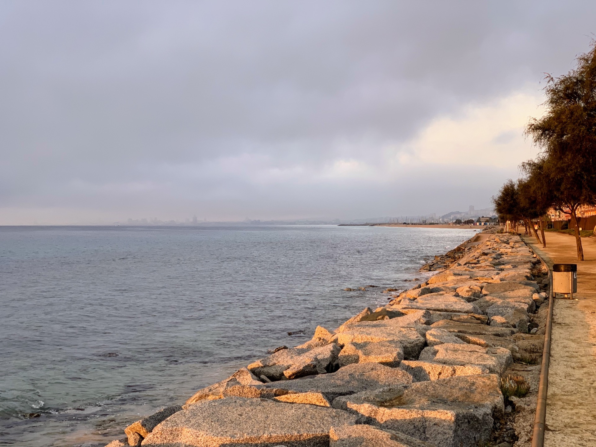
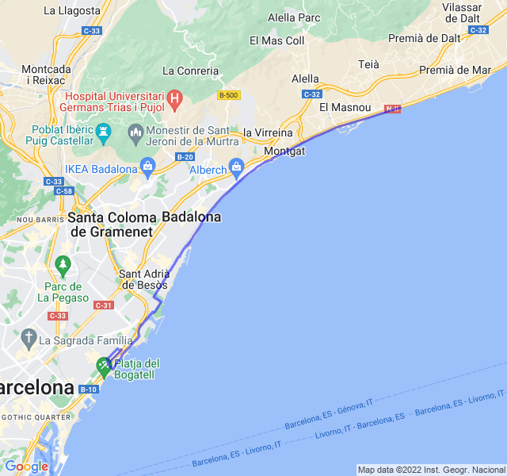

Oggi lunghissimo, il primo (o forse il secondo, non so se considerare il 27km come lunghissimo).

Dopo la settimana disastrosa dal punto di vista del sonno ero persino indeciso se partire stamattina; fortunatamente una volta iniziato a correre è andata meglio del previsto. Ho tenuto un buon ritmo soprattutto per i primi 2/3, poi è sopraggiunta una po' di stanchezza e tutto si è fatto più difficile. Qualche pausa di troppo nella parte finale, forse dovrei portarmi dei sali ma non so mai come fare.

Ora una settimana di "scarico" dove farò la [Mitija de Tarragona](https://www.mitjatarragona.cat/es/) e poi l'ultimo lunghissimo da 36km!


