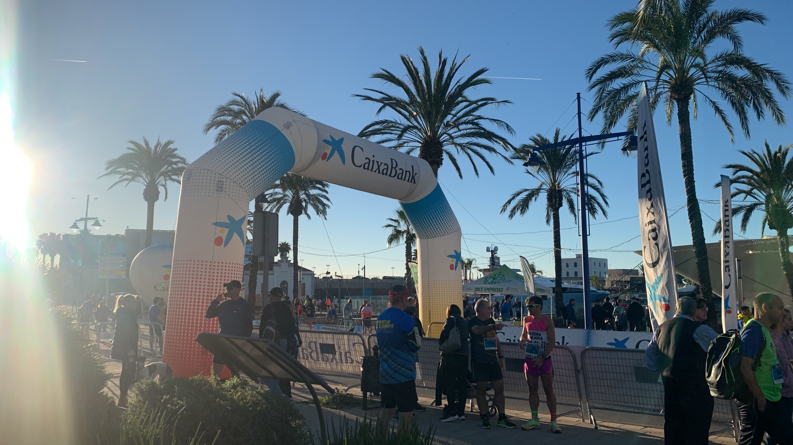
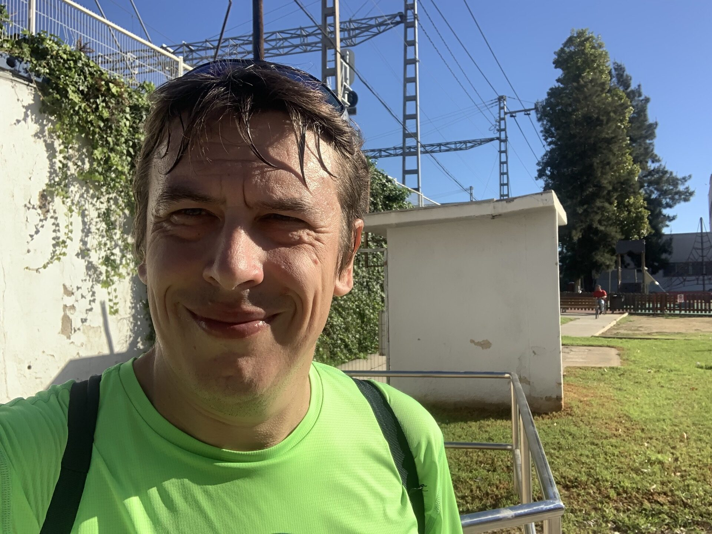
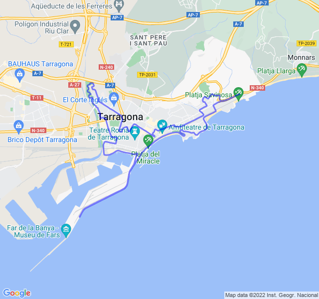

Mezza maratona di Tarragona, prima gara da un sacco di tempo. Situazione un po' strana perchè la devo correre piano per non compromettere gli allenamenti della prossima settimana che sono più importanti in vista della Maratona di Valencia. Purtroppo l'infortunio al ginocchio mi ha fermato per una settimana e ha complicato i piani.

Come temevo sono partito troppo forte ma comunque in controllo. Fila tutto liscio fino a pochi chilometri dall'arrivo dove inizio a sentire qualche fastidio al bicipite femorale, niente di che ma meglio non rischiare.

Alla fine la chiudo con un buon tempo anche se molto lontano dai miei migliori.


