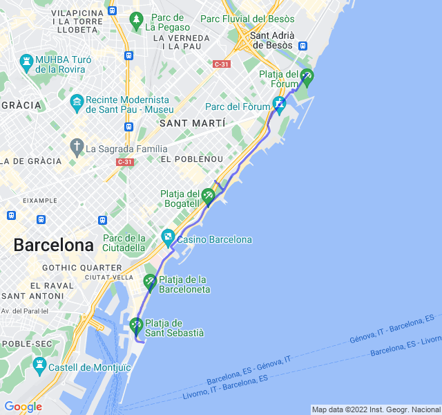

Ottimo allenamento con variazioni. Pensavo di faticare moltissimo dopo la gara di domenica ma in realtà è andato tutto abbastanza liscio.

Gli ultimi 5x100 dovevano essere in salita ma ho sentito un dolore al ginocchio nella prima e quindi ho deciso di farle in pianura e non troppo forte per evitare ulteriori problemi.

 all'attività](https://strava.com/activities/8086960392)
